# QueueUp India

<h2>Screenshots</h2>

<p align="center">
  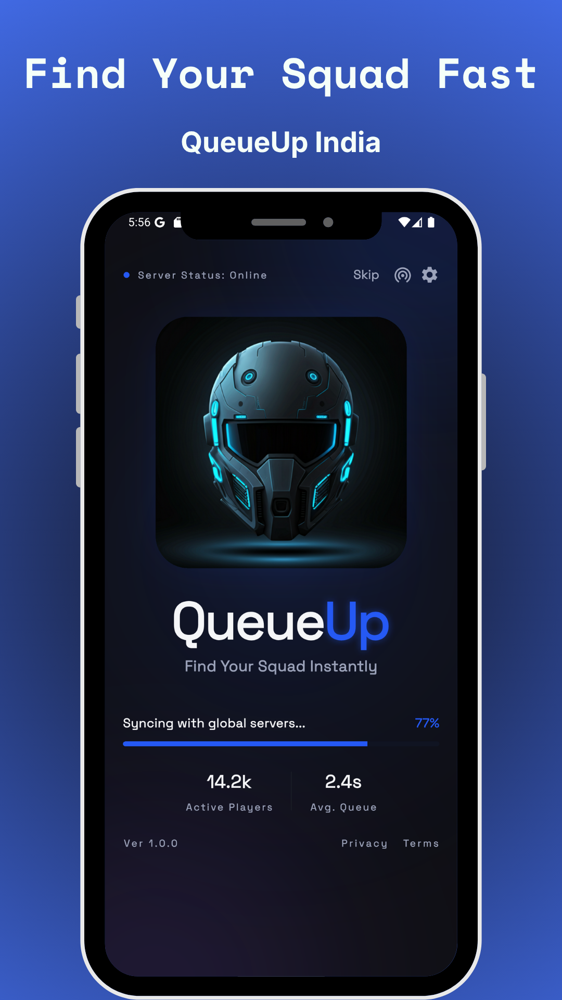
  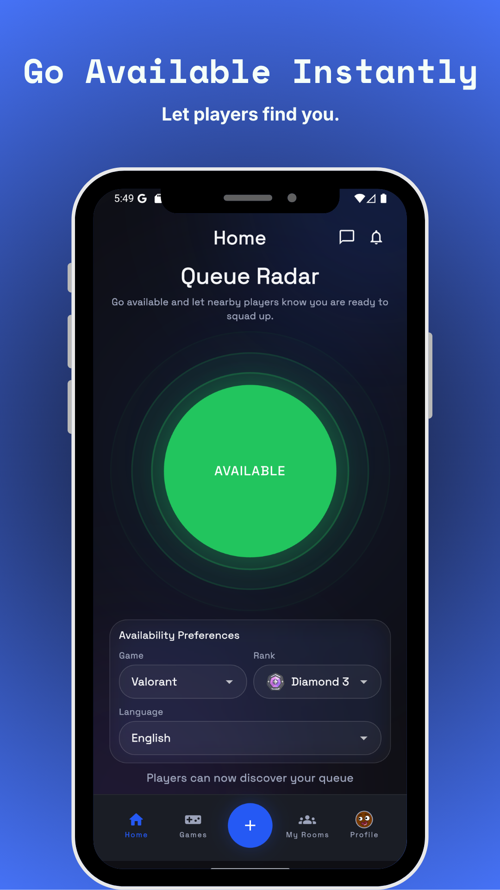
  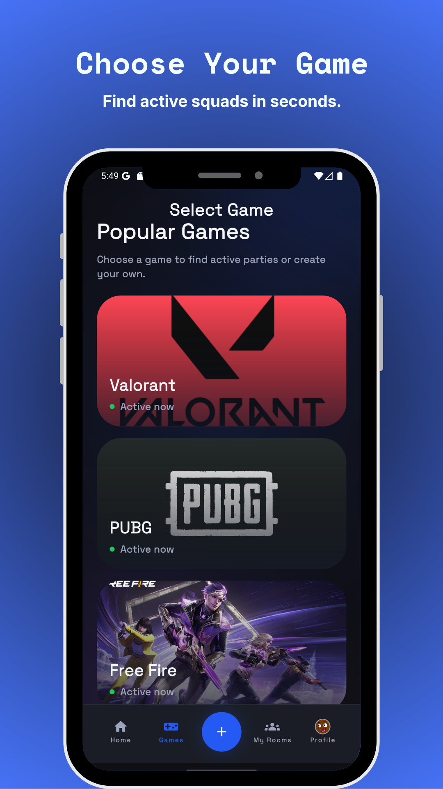
  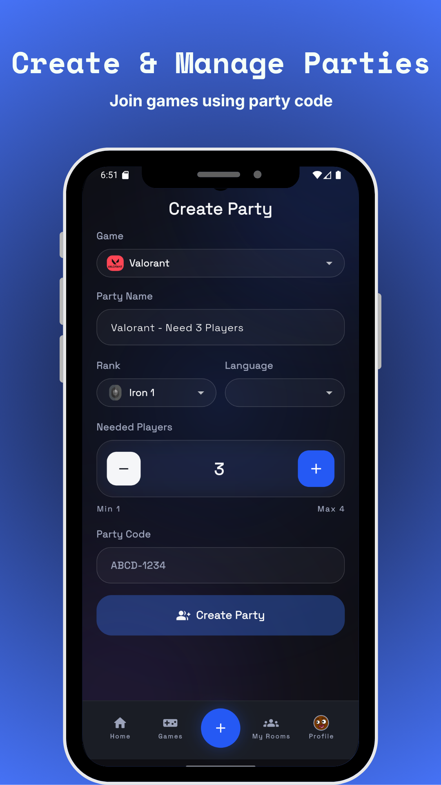
</p>

<p align="center">
  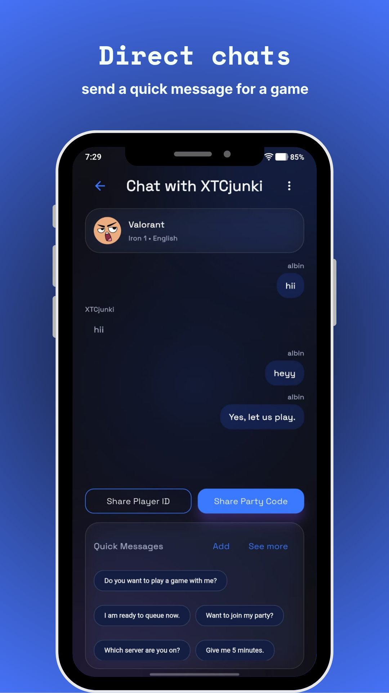
  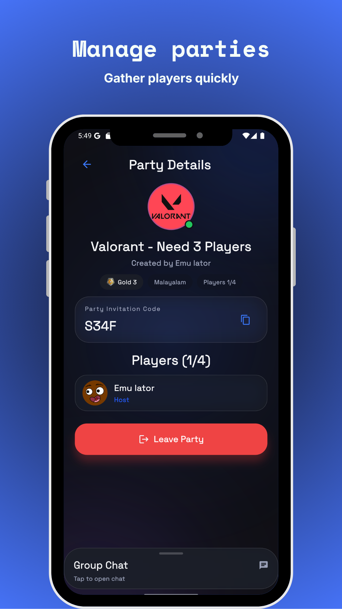
  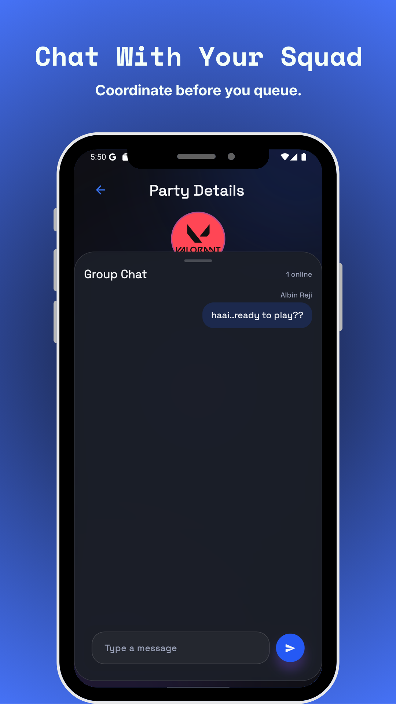
  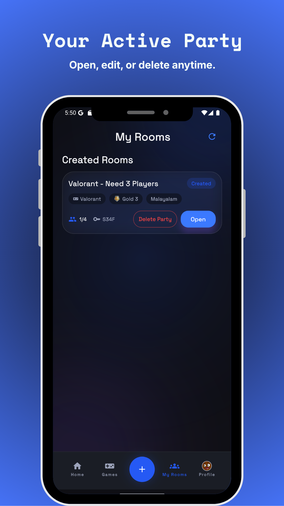
</p>

<p align="center">
  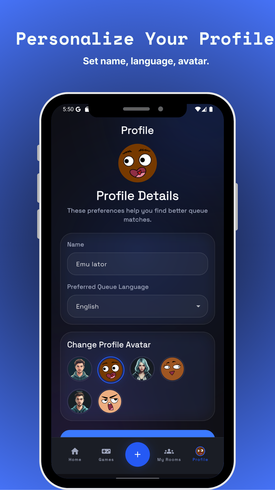
  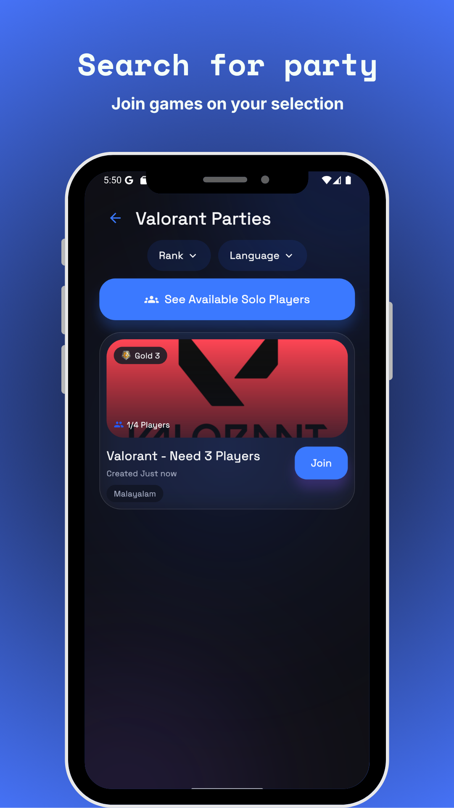
  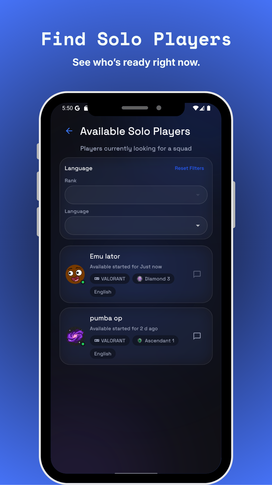
  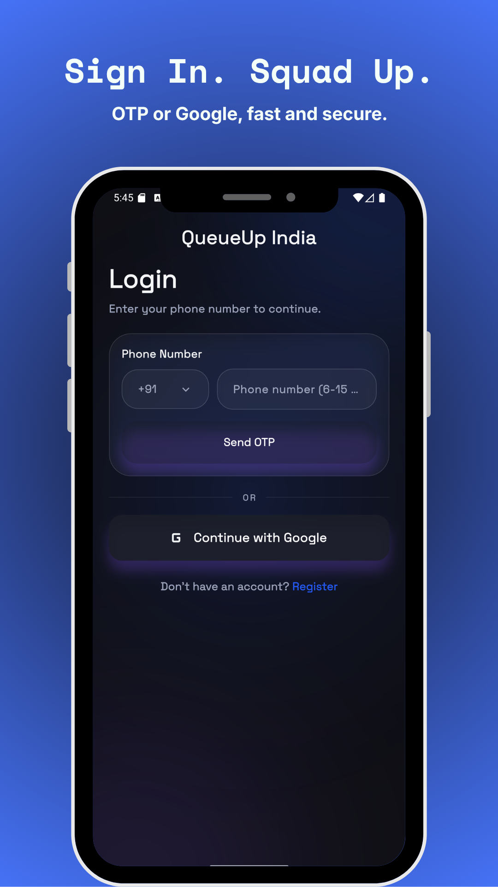
</p>

QueueUp India is a gaming matchmaking app that helps players go available, find solo players, create/join parties, and chat in real time.

## App Prompt
Use this prompt to explain the app in a short, clear way (for stores, decks, or docs):
```
QueueUp India is a gaming matchmaking app where players can set their availability by game, rank, and language — for titles like Valorant, PUBG, and Free Fire — discover solo players, and create or join parties to play together. It supports real‑time direct and party chat plus fast coordination features like quick messages, sharing player IDs/party codes, and notifications. Players can also block or report users for safety, and the app supports all Indian languages while keeping the experience friendly and product‑focused.
```

## Features
- Go available with game, rank, and language preferences
- Discover available solo players
- Create and join parties
- Direct chat and party chat
- Quick messages, share player ID, and party code
- Notifications and badges for requests/messages
- Block and report users

## Tech Stack
- Flutter (Dart)
- Firebase: Auth, Firestore, Cloud Functions, FCM, Crashlytics
- BLoC for state management

## Project Structure
- `lib/` Flutter app source
  - `features/` feature modules (auth, home, party, chat, notifications, settings)
  - `core/` shared utilities, widgets, services, constants
- `android/`, `ios/` platform projects
- `functions/` Firebase Cloud Functions
- `firestore.rules` Firestore security rules

## Setup
1. Install Flutter SDK and Android Studio
2. Install Firebase CLI and FlutterFire CLI
3. From the project root:
   ```bash
   flutter pub get
   ```
4. Create a `.env` file in the project root (see `.env.example`):
   ```env
   FIREBASE_API_KEY=...
   FIREBASE_APP_ID_ANDROID=...
   FIREBASE_APP_ID_IOS=...
   FIREBASE_MESSAGING_SENDER_ID=...
   FIREBASE_PROJECT_ID=...
   FIREBASE_AUTH_DOMAIN=...
   FIREBASE_STORAGE_BUCKET=...
   FIREBASE_IOS_BUNDLE_ID=...
   FIREBASE_ANDROID_APP_ID=...
   ```
5. Run:
   ```bash
   flutter run
   ```

## Firebase Notes
- Crashlytics is enabled for non-debug builds.
- FCM is used for push notifications.
- Firestore stores users, availability, parties, chats, notifications, and reports.
- Reports are stored in the top-level `reports` collection with admin-only read access.

## Build
```bash
flutter build apk --debug
flutter build apk --release
```

## Testing
No automated tests are configured yet.

## Deployment
- Android: Upload AAB/APK to Google Play Console (closed testing recommended first)
- iOS: Upload with Xcode/Transporter

## Legal
- Privacy Policy and Terms should be hosted on your website for store approval.

## Support
For support and inquiries, update this README with your contact email.
